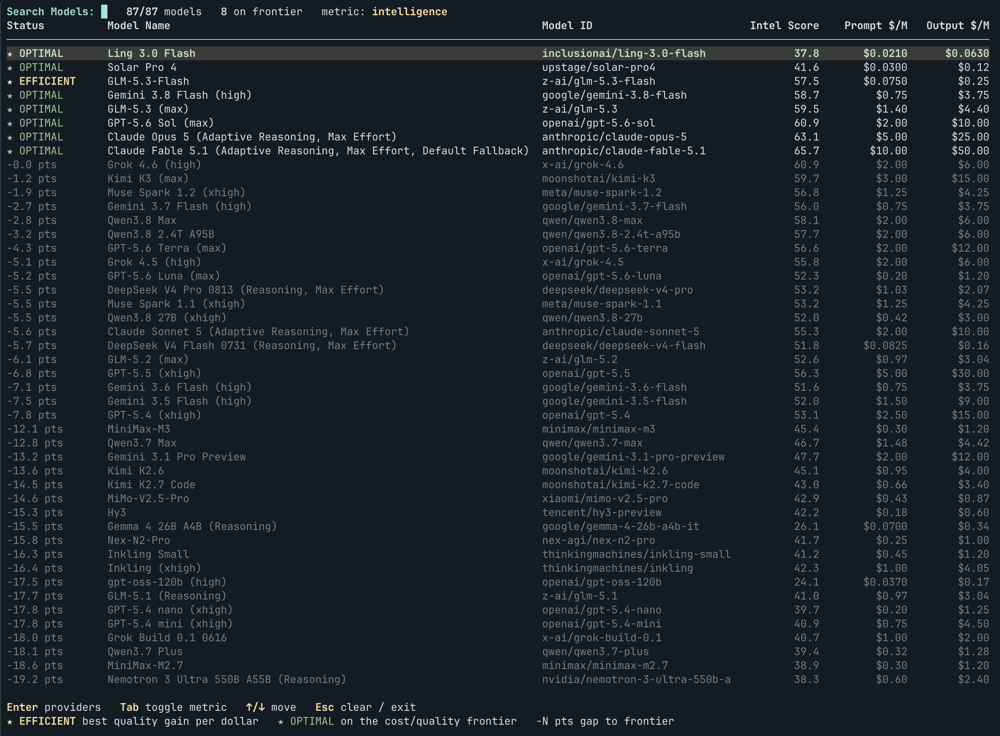

# OpenRouter Frontier

**The price of an LLM call is not the list price. It is the expected cost of the turn, and
that depends on who serves it.** Two providers selling the same model at the same price can
differ by 25% in what you actually pay, because one hits the prompt cache 88% of the time and
the other under 50%, one drops one request in eight and throws away your cached prefix, one makes
you wait four seconds for the first token. Nobody prices that. This does.

OpenRouter Frontier pulls the observed 24-hour metrics for every endpoint serving a model —
prompt **cache hit rate**, p50 **latency** and **throughput**, **uptime**, effective and list
**pricing** — and turns them into a single expected cost per turn, then reasons about it:

- **ProviderScore scoring** – the expected dollars a conversation turn costs on each endpoint:
  cache economics with Bayesian shrinkage for low-traffic endpoints, a value-of-time term, and
  the cost of retrying a failed request. Reported per 1M tokens so it sits on the same scale as
  list prices, and often reorders them. The full model is in [Scoring model](#scoring-model).
- **Pareto frontiers** – which providers are non-dominated across cost, latency, throughput,
  cache hit and uptime at once, and which models no cheaper model out-scores on benchmark
  quality, with the **efficient point** where marginal quality per dollar starts to fall off.
- **Routing** – "I need at least this much intelligence": the model and provider to call, chosen
  from the frontier rather than from a price list.

We also solve the efficient frontier across models, joining OpenRouter's 24-hour realized
pricing (which changes as providers come and go) with Artificial Analysis benchmark scores, so
the cost side of "quality per dollar" reflects what the model costs to call today, not its
list price.

## Installation

```bash
git clone https://github.com/deep-blue-dark-red/openrouter-frontier.git && cd openrouter-frontier
uv venv && source .venv/bin/activate
uv pip install -e .            # installs the `openrouter-frontier` / `or-frontier` CLI
uv pip install -e '.[dev]'     # adds pytest
```

The repo-root scripts (`./score_providers.py`, `./openrouter-tui`, …) locate the local
`.venv` themselves, so they run without activating it. Symlink any of them onto your `$PATH`.

## Tools

| Tool                   | Question it answers                                                                    |
| ---------------------- | -------------------------------------------------------------------------------------- |
| `openrouter-tui`       | Interactive: browse the model frontier, drill into a model's providers                 |
| `score_providers.py`   | Which provider is cheapest for this model, all things considered?                      |
| `provider_frontier.py` | Which providers are non-dominated on cost, latency, TPS, cache hit, uptime?            |
| `model_frontier.py`    | Which models give the most benchmark quality per dollar? Where is the efficient point? |
| `model_router.py`      | I need at least this much intelligence: which model and provider should I call?        |
| `get_models.py`        | Search and inspect the 400+ model catalog                                              |
| `openrouter-frontier` | Rich-coloured CLI: `stats`, `score`, `cache`, `compare`, `search`                      |

All tools accept fuzzy model names: `zai/glm-5.3-flsh`, `z.ai/glm-5.3-flash`, and
`glm-5.3-flash` all resolve to `z-ai/glm-5.3-flash`.

### `openrouter-tui` — interactive explorer

```bash
./openrouter-tui
```



- **Models view** – every benchmarked model, sorted by the cost vs. quality Pareto frontier:
  frontier models first from cheapest up, then dominated models by their gap to the frontier.
  `★ OPTIMAL` marks frontier models, `★ EFFICIENT` the frontier's efficient point (best quality
  gain per dollar), and `-N pts` a dominated model's score gap. Type to filter (`zai`,
  `claude37`, `gemini25` all work; punctuation is ignored). **Tab** switches between the
  intelligence and coding index; the active metric is shown in the status line.
- **Providers view** – **Enter** on a model ranks its endpoints by ProviderScore scored
  cost per 1M tokens. **Tab** or **a** toggles between the primary quantization and all variants.
- **Detail view** – **Enter** on a provider shows the full cost breakdown and pricing.
- Navigation: Up/Down or Ctrl-P/N, PgUp/PgDn, mouse wheel and click, Esc/Backspace to go
  back (Esc clears the search first), Ctrl-C to quit. Runs in the alternate screen buffer so
  your scrollback is untouched.

### `score_providers.py` — cost and utility scoring

```bash
./score_providers.py z.ai/glm-5.3-flash --top 5                 # token cost + failure risk
./score_providers.py z.ai/glm-5.3-flash --time-value 30         # value your time at $30/hr
./score_providers.py z.ai/glm-5.3-flash --no-failures           # pure token cost
./score_providers.py z.ai/glm-5.3-flash --all-quants            # include non-primary quantizations
./score_providers.py z.ai/glm-5.3-flash --json
```

```text
─────────────────────────────────────────────────────────────────────────────────────────────────────────────────────────
ProviderScore Evaluation: Z.ai: GLM 5.3 Flash (z-ai/glm-5.3-flash)
Mode: Full Utility Model  •  Turn: 2000 prompt + 500 completion tokens  •  Time Value: $0.00/hr
Shrinkage: prior=50%, weight=1.0B tokens  •  Discounts: Applied  •  Failure Risk: Yes  •  Quantization: primary
─────────────────────────────────────────────────────────────────────────────────────────────────────────────────────────
Provider            Scored $/M    Token $/M    Fail $/M  CacheHit   h(pub)   Hit $/M   Miss $/M   Latency    TPS   Uptime
─────────────────────────────────────────────────────────────────────────────────────────────────────────────────────────
Z.ai                   $0.0689      $0.0688     $0.0001     85.9%    88.0%   $0.0150    $0.0750     4.35s     34    99.8%
NovitaAI               $0.0767      $0.0766     $0.0001     69.6%    81.7%   $0.0150    $0.0750     1.64s     37    99.7%
GMICloud               $0.0844      $0.0842     $0.0002     53.8%    57.0%   $0.0150    $0.0750     4.10s     31    99.3%
DeepInfra              $0.0863      $0.0861     $0.0002     49.7%    48.1%   $0.0150    $0.0750     0.82s     32    99.3%
Parasail               $0.1418      $0.1409     $0.0009     82.4%    86.7%   $0.0300    $0.1500     1.47s     55    98.8%
─────────────────────────────────────────────────────────────────────────────────────────────────────────────────────────
Lower Scored $/M is better. CacheHit is the shrunk hit rate used in scoring; h(pub) is the published 24h rate.
```

Costs are computed for one turn (2000 prompt + 500 completion tokens by default) and shown
per 1M tokens: `Scored $/M` = `Token $/M` + `Time $/M` + `Fail $/M`.

By default only the model's primary quantization (usually `fp8`) is shown, matching the
variant OpenRouter prices on the web. Pass `--all-quants` to see community variants too.

### `provider_frontier.py` — provider Pareto frontier

Rather than guessing a dollar value for your time, this reports which providers are
**non-dominated** across five objectives: scored cost ↓, latency ↓, throughput ↑, cache hit
rate ↑, uptime ↑.

```bash
./provider_frontier.py z.ai/glm-5.3-flash
./provider_frontier.py z.ai/glm-5.3-flash --optimal-only
./provider_frontier.py --models --optimal-only      # catalog-wide: turn cost vs context vs cache pricing
```

```text
──────────────────────────────────────────────────────────────────────────────────────────────────────────────────────────────────
Provider Pareto Frontier: Z.ai: GLM 5.3 Flash (z-ai/glm-5.3-flash)
Turn: 2000 prompt + 500 completion tokens
Objectives: Cost ↓  Latency ↓  TPS ↑  CacheHit ↑  Uptime ↑  •  Quantization: primary
──────────────────────────────────────────────────────────────────────────────────────────────────────────────────────────────────
Provider            Scored $/M    Token $/M   Latency    TPS  CacheHit   Uptime  Pareto Frontier  Niche / Advantage
──────────────────────────────────────────────────────────────────────────────────────────────────────────────────────────────────
Z.ai                   $0.0689      $0.0688     4.35s     34     85.9%    99.8%  ★ OPTIMAL        Lowest Cost • Best Cache Hit
NovitaAI               $0.0767      $0.0766     1.64s     37     69.6%    99.7%  ★ OPTIMAL        Balanced Trade-off
GMICloud               $0.0844      $0.0842     4.10s     31     53.8%    99.3%  Dominated        --
DeepInfra              $0.0863      $0.0861     0.82s     32     49.7%    99.3%  ★ OPTIMAL        Balanced Trade-off
Parasail               $0.1418      $0.1409     1.47s     55     82.4%    98.8%  ★ OPTIMAL        Balanced Trade-off
Modal                  $0.1690      $0.1690     0.44s     53     53.2%    99.9%  ★ OPTIMAL        Lowest Latency • Highest Uptime
io.net                 $0.1787      $0.1722     1.63s     10     49.8%    86.4%  Dominated        --
──────────────────────────────────────────────────────────────────────────────────────────────────────────────────────────────────
★ OPTIMAL marks non-dominated providers: no other provider is at least as good on every objective and better on one.
```

### `model_frontier.py` — cost vs. quality frontier

Joins OpenRouter's published Artificial Analysis indices (intelligence, coding, agentic) with
live pricing and finds the models no cheaper model out-scores. The **efficient point** is the
frontier model with the best normalised quality gain per dollar, the maximum-gradient point of
the frontier.

```bash
./model_frontier.py                                 # intelligence index vs list prompt price
./model_frontier.py --metric coding --all-models    # include dominated models with their gap
./model_frontier.py --price-source call -c 2000 -o 500
./model_frontier.py --format markdown
```

```text
OpenRouter Cost vs. Intelligence Pareto Frontier
8 non-dominated of 87 benchmarked models  •  price source: list
──────────────────────────────────────────────────────────────────────────────────────────────────
Model                        ID                             Intelligence Score  Cost ($/1M prompt)  Status
──────────────────────────────────────────────────────────────────────────────────────────────────
Ling 3.0 Flash               inclusionai/ling-3.0-flash                   37.8               $0.02  ON FRONTIER
Solar Pro 4                  upstage/solar-pro4                           41.6               $0.03  ON FRONTIER
GLM-5.3-Flash                z-ai/glm-5.3-flash                           57.5               $0.07  ← EFFICIENT
Gemini 3.8 Flash (high)      google/gemini-3.8-flash                      58.7               $0.75  ON FRONTIER
GLM-5.3 (max)                z-ai/glm-5.3                                 59.5               $1.40  ON FRONTIER
```

### `model_router.py` — model and provider for a required score

Picks a benchmarked model whose Artificial Analysis score meets a threshold, then that
model's best provider from the ProviderScore scorer. Two modes choose the model:

- `cheapest` – the cheapest model at or above the score.
- `efficient` – the efficient point of the cost/quality frontier built from the models at or
  above the score: the most quality gained per dollar once the level is met.

Models with no active provider are skipped in favour of the next best qualifying one.

```bash
./model_router.py 60                                # cheapest model with intelligence >= 60
./model_router.py 60 --mode efficient               # most quality per dollar above 60
./model_router.py 45 --metric coding --time-value 30
./model_router.py 70 --json
```

```python
from model_router import route
r = route(60, metric="intelligence", mode="efficient")
r.model_id, r.provider.provider_slug, r.provider.total_cost_per_m
```

### `get_models.py` — catalog search and inspection

```bash
./get_models.py z-ai/glm-5.3-flash               # detail card: context, pricing, description
./get_models.py -q flash --top 10
./get_models.py --creator anthropic --sort context
./get_models.py --caching --sort price --top 10  # only models with a cache-read price
./get_models.py --refresh                        # bypass the 1-hour catalog cache
```

### `openrouter-frontier` — Rich CLI

```bash
openrouter-frontier stats   z-ai/glm-5.3-flash --sort cache --top 5   # 24h metrics table
openrouter-frontier score   z-ai/glm-5.3-flash --time-value 30        # ProviderScore ranking
openrouter-frontier cache   z-ai/glm-5.3-flash novita                 # one provider's cache economics
openrouter-frontier compare z-ai/glm-5.3-flash z-ai novita deepinfra  # side by side
openrouter-frontier search  glm
```

`stats --sort` accepts `cache`, `score`, `token_cost`, `latency`, `tps`, `uptime`, `input`,
`output`, `tokens`, `share`, `name`. Every command takes `--json`.

## Scoring model

Let $C$ be prompt tokens and $O$ completion tokens per turn (defaults 2000 and 500). Prices are
USD per million tokens from the endpoints API: $\text{in}$, $\text{out}$, and optionally
$\text{read}$ (cache read) and $\text{write}$ (cache write).

**Cache prices.** If the endpoint has no cache-read price it has no cache: every prompt token
is a miss at the input price and the hit rate is forced to zero.

$$
\text{hitPrice} = \begin{cases}\text{read} & \text{if present}\\ \text{in} & \text{otherwise}\end{cases}
\qquad
\text{missPrice} = \begin{cases}\text{in} & \text{if read absent}\\ \text{write} & \text{if write present}\\ \text{in} & \text{otherwise}\end{cases}
$$

**Bayesian shrinkage.** The published 24-hour hit rate $h$ of a low-traffic endpoint is noisy.
It is shrunk toward a prior using the endpoint's 24-hour token volume $T$ as evidence and a
pseudo-count $W$ (in tokens) behind the prior:

$$
h_{\text{used}} = \frac{h \cdot T + \text{prior} \cdot W}{T + W}
\qquad(\text{prior}=0.5,\; W = 10^9 \text{ by default})
$$

An endpoint that served $10^9$ tokens sits halfway between its observed rate and the prior; one
that served $10^{11}$ tokens is almost entirely trusted.

**Token cost.**

$$
\text{tokenCost} = \frac{C\,\big(h_{\text{used}}\,\text{hitPrice} + (1-h_{\text{used}})\,\text{missPrice}\big) + O\,\text{out}}{10^6} + \text{requestFee}
$$

**Time cost.** With a value of time $v$ in USD/hour, waiting for the first token and streaming
the completion at $\text{tps}$ tokens/s costs

$$
\text{timeCost} = \frac{v}{3600}\left(\text{ttft} + \frac{O}{\text{tps}}\right)
$$

**Failure cost.** With probability $1-\text{uptime}$ the request fails and is retried elsewhere,
losing the cached prefix (the cached share is paid at miss price instead of hit price) and the
time already spent waiting:

$$
\text{failureCost} = (1-\text{uptime})\left[\frac{C\,h_{\text{used}}\,(\text{missPrice}-\text{hitPrice})}{10^6} + \frac{v}{3600}\,\text{ttft}\right]
$$

$$
\text{totalCost} = \text{tokenCost} + \text{timeCost} + \text{failureCost}
$$

All four are per-turn dollar amounts; the tools display them normalised to 1M tokens,
$\text{cost} \cdot 10^6 / (C + O)$. `--time-value 0 --no-failures` reduces this to the pure
token cost model.

## Pareto analysis

**Dominance.** Provider $b$ dominates $a$ if $b$ is at least as good on every objective and
strictly better on at least one. Providers that nobody dominates form the frontier. A missing
metric is treated as the worst possible value, so an endpoint with no latency data can never
win on latency. The provider frontier uses scored cost, TTFT, throughput, $h_{\text{used}}$,
and uptime; the catalog frontier (`provider_frontier.py --models`) uses turn cost, context
length, cache-read price, and completion price.

**Cost vs. quality frontier** (`model_frontier.py`, TUI). Models are sorted by ascending cost; a
model is on the frontier when its score exceeds every cheaper model's score. For a dominated
model, the reported gap is the best frontier score available at or below its cost minus its own
score.

**Efficient point.** Both axes are min–max normalised over the frontier to $[0,1]$. The
efficient point is the frontier model maximising $\hat{s} - \hat{c}$, i.e. the point furthest
above the chord joining the cheapest and the best-scoring frontier models. That is where the
marginal quality gained per dollar starts to fall off.

## Python API

```python
from openrouter_frontier import (
    ScoringConfig, score_model_providers, get_model_stats,
    Objective, pareto_mask,
)

# Rank providers by expected cost (token cost + failure risk by default).
for s in score_model_providers("z-ai/glm-5.3-flash")[:3]:
    print(f"{s.provider_name:<12} {s.formatted_total_cost}/M  cache hit used {s.formatted_h_used}")

# A longer-context agentic turn, valuing time at $30/hr.
cfg = ScoringConfig(prompt_tokens=8000, completion_tokens=1000, time_value_usd_per_hour=30.0)
best = score_model_providers("z-ai/glm-5.3-flash", config=cfg)[0]

# Raw 24h stats, sorted however you like.
stats = get_model_stats("glm-5.3-flash")
fastest = stats.sort_by("latency")[0]

# Generic N-objective Pareto mask over your own objects.
scores = stats.score_providers()
mask = pareto_mask(scores, [
    Objective(lambda s: s.total_cost_usd, minimize=True),
    Objective(lambda s: s.ttft_seconds, minimize=True),
    Objective(lambda s: s.uptime_pct, minimize=False),
])
frontier = [s.provider_name for s, ok in zip(scores, mask) if ok]
```

## Data sources

| Endpoint                                               | Provides                                                           |
| ------------------------------------------------------ | ------------------------------------------------------------------ |
| `api/frontend/v1/stats/effective-pricing`              | per-endpoint 24h cache hit rate, effective prices, token volume    |
| model page RSC payload (`openrouter.ai/models/<slug>`) | p50/p90 latency and throughput, 24h uptime                         |
| `api/v1/models/<slug>/endpoints`                       | list pricing incl. cache read/write, quantization, uptime fallback |
| `api/v1/models`                                        | catalog: context length, modality, list pricing                    |
| `api/frontend/v1/rankings/benchmarks`                  | Artificial Analysis intelligence / coding / agentic indices        |

Connections are forced to IPv4 to avoid a ~10 s IPv6 stall on macOS.

## Development

```bash
uv pip install -e '.[dev]'
pytest                      # unit tests for the scoring and Pareto math
```

## License

MIT
